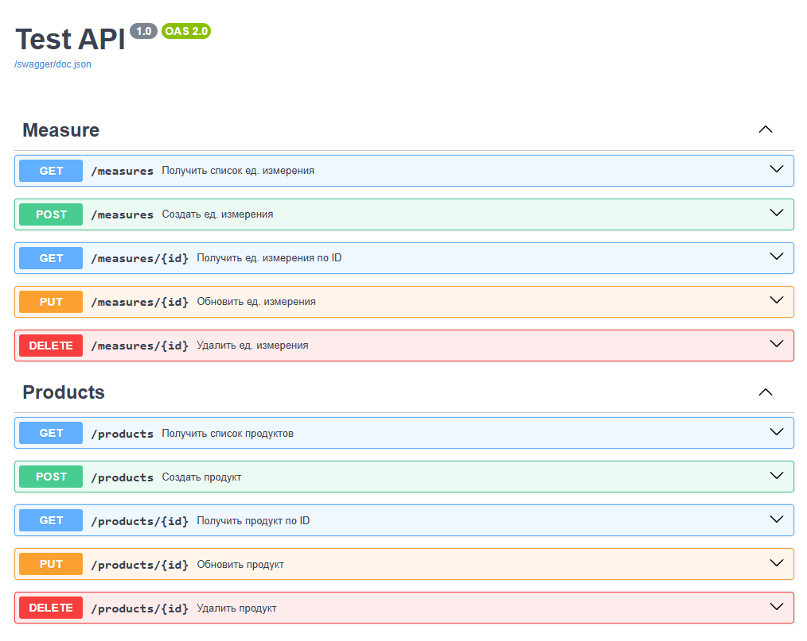

# Curly Spork API

REST API для управления продуктами и единицами измерения, созданный на Go с использованием Fiber, GORM и Swagger.



## 📦 Технологии

- [Go](https://golang.org/)
- [Fiber](https://github.com/gofiber/fiber) – Web-фреймворк
- [GORM](https://gorm.io/) – ORM для Go
- [Swagger (Swaggo)](https://github.com/swaggo/swag) – Генерация документации API
- [PostgreSQL](https://www.sqlite.org/) – База данных (или другая, в зависимости от конфигурации)
- [Docker + docker-compose](https://docs.docker.com/compose/) – Контейнеризация приложения

## 🚀 Установка и запуск

> ⚠️ Требования:
> - Go 1.20+
> - Docker (если планируешь запускать в контейнере)

### 🛠️ Локальный запуск

1. Склонируй репозиторий:

   ```bash
   git clone https://github.com/Wereker/curly-spork.git
   cd curly-spork
   ```

2. Установи зависимости и сгенерируй Swagger-документации:

    ```bash
    go mod tidy
    swag init -g cmd/main.go
    ```

3. Запусти приложение:

    ```bash
    go run cmd/main.go
    ```

4. Перейди в браузере по адресу: http://localhost:3000/swagger/index.html

### 🐳 Запуск с Docker

```bash
docker-compose -f deployments/docker-compose.yml up --build
```

API будет доступен на http://localhost:3000/swagger/index.html.

### 🧭 Swagger UI

Документация автоматически генерируется из комментариев к хендлерам и доступна по пути `/swagger`.

### 🗂️ Структура проекта

```txt
curly-spork/
├── cmd/                # Точка входа (main.go)
├── internal/
│   ├── db/             # Подключение к БД
│   ├── handlers/       # Обработчики запросов
│   ├── models/         # Модели GORM
│   ├── routes/         # Роутинг
│   └── response/       # Схемы
├── docs/               # Сгенерированные файлы Swagger
├── deployments/        # docker-compose
├── build/              # Dockerfile
├── go.mod
└── README.md
```